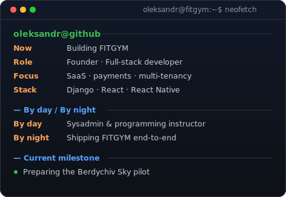

<!-- Regenerate the profile art after changing its copy:
     python3 scripts/make_xand_terminal.py
     python3 scripts/make_info_card.py -->
<table>
  <tr>
    <td valign="top"></td>
    <td valign="top"></td>
  </tr>
</table>

# Oleksandr Riasnyi
### Founder · Full-stack Developer

> Building **FITGYM** — a SaaS CRM for Ukrainian fitness clubs.

 

---

### 👋 About

**By day**, I work as a sysadmin and programming instructor at IT STEP Academy in Berdychiv —
supporting Windows infrastructure, MikroTik / RouterOS networks and video surveillance.

**By night**, I build **FITGYM** end-to-end: a multi-tenant SaaS CRM for Ukrainian fitness
clubs, from Django REST APIs and payments to React owner panels, React Native apps,
deployment and CI/CD.

FITGYM is preparing for its first pilot at **Berdychiv Sky**.

🎓 Software Engineering at Berdychiv College — graduating **2026**.

---

### 🛠 Tech Stack

**Backend**

**Frontend & Mobile**

**Infrastructure & Tools**

---

### 🚀 Building — FITGYM CRM

**[FITGYM CRM →](https://github.com/xand0dev/FITGYM-demo)** is a multi-tenant B2B SaaS
for local fitness clubs, with client mobile and web owner panels on one REST API.

**What it does**
- 🏢 **Multi-tenant gym isolation** — every query is scoped to the user's club; fail-closed, no cross-tenant leaks.
- 📲 **Signed QR check-in** — the app generates an HMAC-signed QR pass; a scanner validates access with a green/red result.
- ⏰ **Time-limited subscriptions** — e.g. a *Morning Pass* valid only 08:00–13:00 in the gym's timezone, enforced at the door.
- 💳 **Per-gym payments** — each club connects its **own LiqPay merchant** (encrypted keys); the platform charges a flat subscription, not a cut of transactions.
- 🧾 **Staff audit log** — append-only trail of who did what (sales, wallet edits, settings), for owner transparency.
- 🌐 **White-label** — each club gets its own branded landing (subdomain or custom domain) and client app.

---

### 🐍 Contribution graph

---

**Let's talk** — pilot gyms, collaboration and backend / full-stack work.

