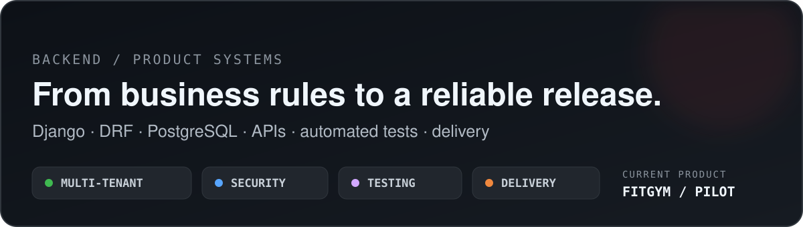

# Oleksandr Riasnyi

### Python Backend Developer · Django / DRF / PostgreSQL

Building a pilot-ready multi-tenant SaaS CRM with secure APIs, real business rules, and automated backend tests.

 

## What I build

I design backend systems around **real business constraints**, not demo-only CRUD. My primary stack is Python, Django, Django REST Framework, and PostgreSQL; React and React Native are supporting tools when a product needs end-to-end delivery.

My current focus is **FITGYM**, a multi-tenant SaaS CRM moving through controlled pre-launch with Berdychiv Sky. My work spans backend architecture, API design, authorization, business rules, automated testing, integrations, and release engineering across the product lifecycle.

## Backend engineering

- **Multi-tenant boundaries** — tenant-scoped queries, explicit role checks, and object-ownership enforcement on the server.
- **Business invariants** — booking eligibility, capacity, duplicate prevention, and time-window rules enforced beyond the UI.
- **Security-sensitive flows** — HMAC-signed QR access, rate limiting, audit trails, and hardened public booking endpoints.
- **Transactional workflows** — wallet ledger operations and LiqPay payment flows designed around traceable state changes.
- **Delivery discipline** — automated backend tests, CI gates, Docker deployments, release preflight, and smoke checks.

## FITGYM — Product & Engineering

> **Private product codebase · Public engineering showcase · Controlled pre-launch with Berdychiv Sky**

FITGYM combines a Django/DRF API and PostgreSQL data model with React administration workflows and a React Native/Expo member application. The system covers tenant-aware CRM operations, scheduling and booking, memberships, access control, payments, and staff accountability.

The public repository is intentionally a **product and engineering showcase**, not a source-code distribution. It contains synthetic product screens, short workflow videos, architecture context, and an honest launch status.

[Explore the FITGYM product →](https://github.com/xand0dev/FITGYM-demo) 
[Watch the 19-second pilot workflow →](https://github.com/xand0dev/FITGYM-demo/blob/main/assets/sky-public-booking-demo.mp4)

For a technical interview, I can walk through sanitized architecture decisions, representative test output, security boundaries, and non-proprietary code fragments.

## Public code — TraceFlow

[**TraceFlow**](https://github.com/xand0dev/TraceFlow) is an MVP VS Code extension that turns Django, React, and React Native projects into an interactive architecture graph.

The public implementation combines a Python `ast` parser, TypeScript, the VS Code API, WebSockets, and ReactFlow. It is distributed through the [Visual Studio Marketplace](https://marketplace.visualstudio.com/items?itemName=xand0dev.traceflow-viz) and [Open VSX](https://open-vsx.org/extension/xand0dev/traceflow-viz).

`Python AST analysis` · `TypeScript extension host` · `ReactFlow webview` · `local telemetry`

## Stack

| Focus | Tools and practices |
|---|---|
| **Backend** | Python · Django · Django REST Framework · PostgreSQL · REST APIs · automated testing |
| **Architecture & security** | Multi-tenancy · RBAC · object ownership · HMAC · audit logging · rate limiting |
| **Delivery** | Docker · GitHub Actions · Render · Neon · Cloudflare Pages · release smoke checks |
| **Product surfaces** | TypeScript · React · React Native · Expo |

<strong>Additional operational context</strong>

 
Supporting a Windows workstation fleet and real users has sharpened my production debugging, incident ownership, and communication. I also teach Python and robotics, which keeps technical explanations practical and precise.

---

### Currently open to

**Python Backend Developer** and backend-leaning Full-Stack roles, with a focus on Django/DRF systems.

[LinkedIn](https://www.linkedin.com/in/oleksandr-riasnyi/) · [Email](mailto:oleksandr.riasnyi.dev@gmail.com)
