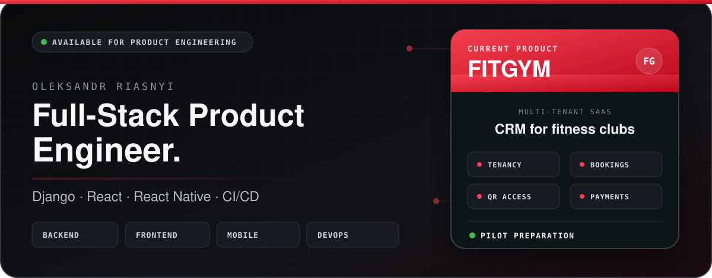
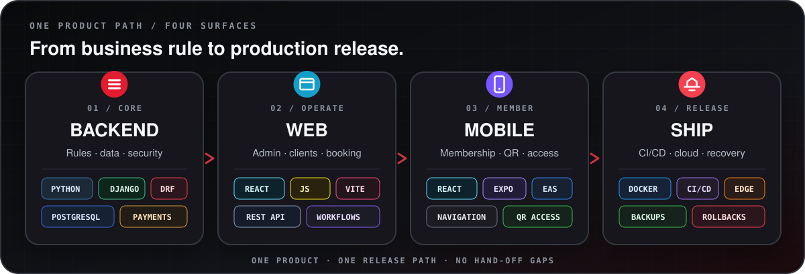
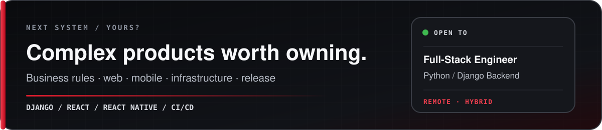

 

## The short version

I build products end to end: **business rules, APIs, web interfaces, mobile apps, cloud infrastructure, and the release path between them**.

My strongest engineering proof is **FITGYM**: a real, private-codebase SaaS product preparing for a controlled pilot with Berdychiv Sky. I work hands-on as its technical lead, lead full-stack engineer, and release owner. Python/Django is my deepest specialization—not the boundary of my role.

## What I own end to end

## FITGYM / built beyond the demo

> **Real product · Private codebase · Controlled pilot preparation**

FITGYM is a multi-tenant operating platform for fitness clubs—not a dashboard assembled for a portfolio. I co-founded it and lead its product and technical direction while working across the Django/DRF backend, React operations panel, React Native member app, integrations, infrastructure, and releases.

The difficult part is not CRUD. Each club must remain isolated while bookings, capacity, memberships, QR access, payments, and staff actions obey server-side rules under real operational pressure.

The release path is part of the product: CI gates, containerized deployment, managed PostgreSQL, web and mobile delivery, backup/restore verification, post-deploy smoke checks, and rollback planning.

**[See the product, the workflows, and the engineering decisions →](https://github.com/xand0dev/FITGYM-demo)**

## Contribution streak

## Let's build something that has to work

 

