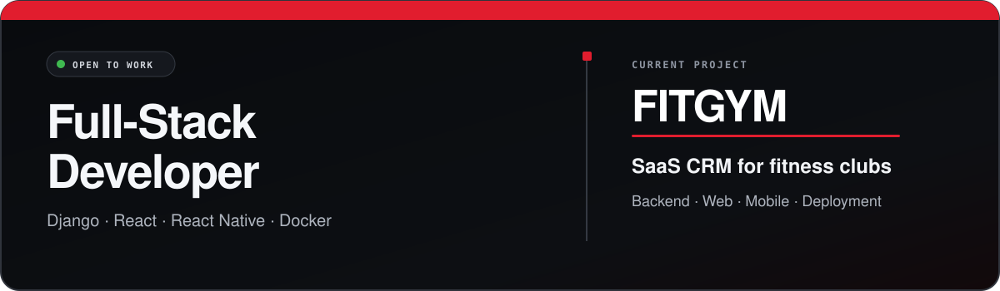
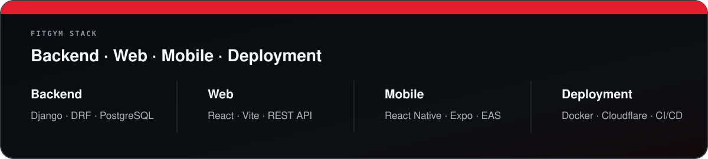
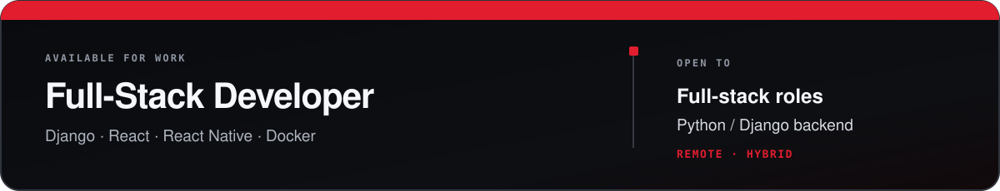

 

## About

Full-stack developer working across Django APIs, React web apps, React Native mobile apps, and deployment.

I co-founded **FITGYM**, a multi-tenant CRM for fitness clubs, and work across its backend, admin panel, member app, infrastructure, and releases.

## FITGYM stack

**[Screenshots, demos, and project status →](https://github.com/xand0dev/FITGYM-demo)**

## Contribution streak

## Contact

 

