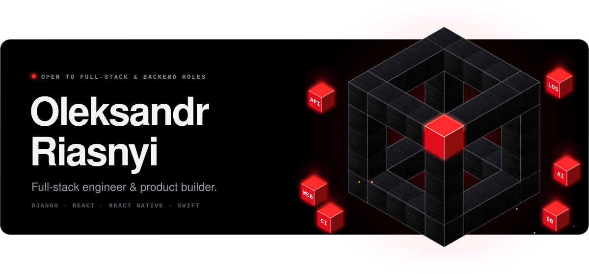

 

  <a href="mailto:oleksandr.riasnyi.dev@gmail.com?subject=SkillForge%20demo">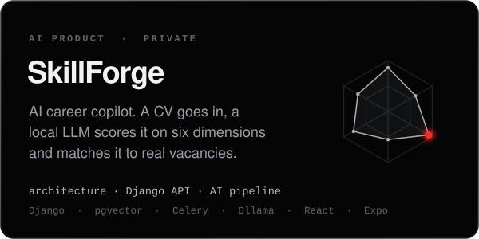</a>
  <a href="https://github.com/xand0dev/FITGYM-demo">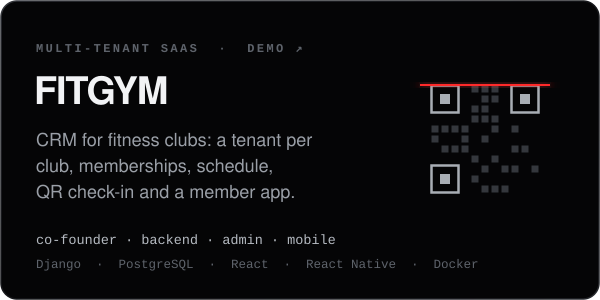</a>
  <a href="mailto:oleksandr.riasnyi.dev@gmail.com?subject=LeadForge%20demo">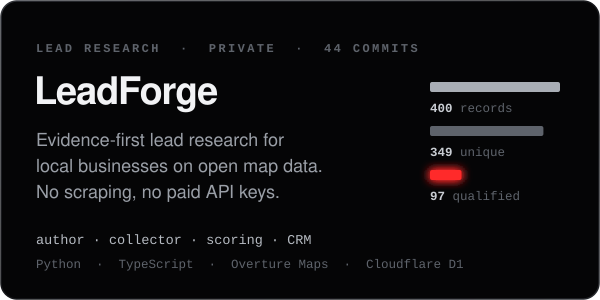</a>
  <a href="mailto:oleksandr.riasnyi.dev@gmail.com?subject=CogniTrace%20demo">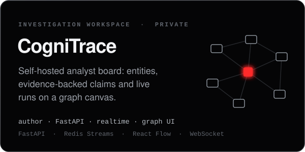</a>

  <a href="https://github.com/xand0dev/VoidBar">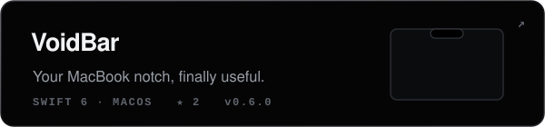</a>
  <a href="https://github.com/xand0dev/eden-zero">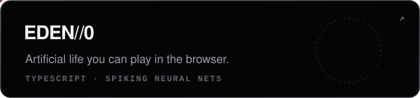</a>
  <a href="https://github.com/xand0dev/TraceFlow">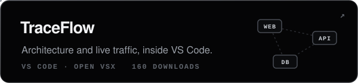</a>
  <a href="https://github.com/xand0dev/zerotokens-skill">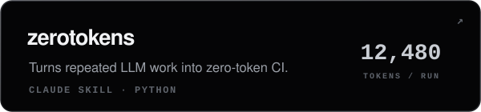</a>
  <a href="https://github.com/xand0dev/django-saas-toolkit">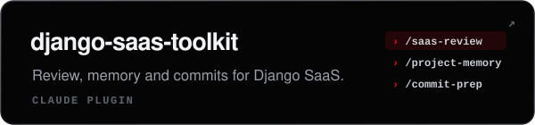</a>
  <a href="https://github.com/xand0dev/ai-pool-starter">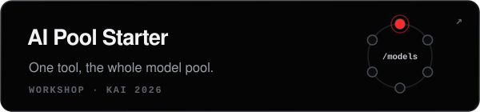</a>

<a href="https://github.com/xand0dev?tab=overview">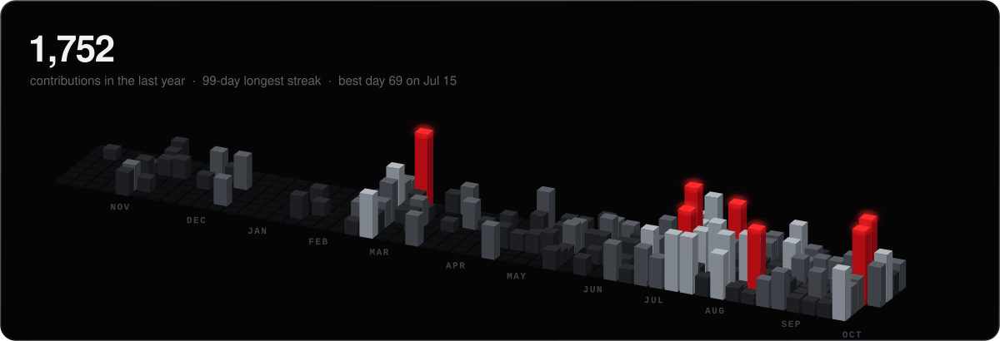</a>

  

  
  &nbsp;
  

